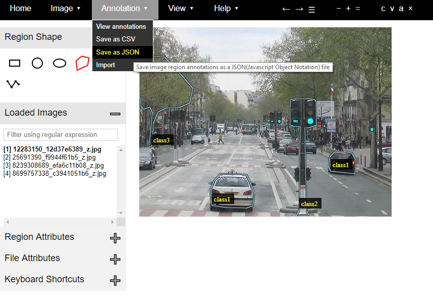

# Mask R-CNN python implementation for training and testing custom datasets
This implementation of [Mask R-CNN](https://arxiv.org/abs/1703.06870) on Python 3, Keras and Tensorflow is a simplified version of the [matterport Mask_RCNN](https://github.com/matterport/Mask_RCNN) implementation. This implementation allows the user to train and test on custom datasets, by following some basic and specific dataset structuring.

The [training](maskrcnntrain.py) and [testing](maskrcnninference.py) code has cues from the [matterport Mask R-CNN](https://github.com/matterport/Mask_RCNN) with some custom changes to allow easy structuring of dataset and the ability to train on custom multiclass datasets.

Please read through the following steps carefully to go about successfully training and testing Mask R-CNN on a custom annotated dataset.

## Step by Step guide to training a custom Mask R-CNN

To train on a custom dataset without making any changes to the code, implement the following steps as it is.

### 1. Dividing the dataset into training and validation set

* Put the training set in this [folder](TrainingImages/train)
* Put the validation set in this [folder](TrainingImages/val)

### 2. Annotating the dataset

* For annotating the dataset, we use [via 1.0.6](http://www.robots.ox.ac.uk/~vgg/software/via/) - download the tool using this [link](http://www.robots.ox.ac.uk/~vgg/software/via/downloads/via-1.0.6.zip)
* Load the images from the [training set folder](TrainingImages/train) onto the tool and select the polygon tool to mark regions for annotation


* After marking regions of different classes on the images, select the Region Attributes tab and create a column with the name as Class and give a class-name of your choice to each object in the column


* Once region annotations have been made for all the images, download the annotation in form of a JSON file and name the file 'RegionJson.json'


* Save the 'RegionJson.json' into the [training set folder](TrainingImages/train).
* Repeat the above procedure for the validation set and save its 'RegionJson.json' into the [validation set folder](TrainingImages/val).

### 3. Training

This implementation uses transfer-learning to train a new model. One can either use the pre-trained [MS-COCO dataset](http://cocodataset.org/#home) weights or weights saved from a previous training. This also allows the user to continue training a dataset for more epochs if the user is not satisfied with the results.

* Download the matterport pre-trained MS-COCO weights from this [link](https://github.com/matterport/Mask_RCNN/releases/download/v2.0/mask_rcnn_coco.h5)
* Save these weights into the main repository folder.
* In the [maskrcnntrain.py](maskrcnntrain.py) script edit the variable named CLASSES to a list of the class names of the classes used for annotating the training set and the test step
* Install dependencies
  ```bash
  pip install -r requirements.txt
  ```
* Run from command line as such(recommended python 3.6.5) -

  **To train a new model starting from pre-trained COCO weights**
  ```bash
  python maskrcnntrain.py coco
  ```

  **To continue training a model trained earlier**
  ```bash
  python maskrcnntrain.py last
  ```
* Once trained we can find the weights of each subsequent epoch in the 'logs' folder

## Testing/Inference from trained weights

For testing we can either use the [pre-trained MS-COCO weights](https://github.com/matterport/Mask_RCNN/releases/download/v2.0/mask_rcnn_coco.h5), weights from the last training session saved in the 'logs' folder or custom trained weights.

To avoid making any changes in the code follow through the following steps as it is.

* Make sure that the custom trained weights and the [MS-COCO weights](https://github.com/matterport/Mask_RCNN/releases/download/v2.0/mask_rcnn_coco.h5) are saved in the main repository folder.
* Rename the custom weights to 'trainedweights.h5'
* (Skip this step if using MS-COCO weights for testing)In the [maskrcnninference.py](maskrcnninference.py) script edit the variable named CLASSES to a list of the class names of the classes used for training custom trained weights or in the last training.
* Put all the images to test in [this](TestImages/Images) folder
* Run from command line as such(recommended python 3.6.5) -

  **Using trained coco weights for inference**
  ```bash
  python maskrcnninference.py coco
  ```

  **Using the last saved weights by maskrcnntrain.py for inference**
  ```bash
  python maskrcnninference.py last
  ```

  **Using custom trained weights for inference**
  ```bash
  python maskrcnninference.py custom
  ```
* Once processed the inferred images are found in this [folder](TestImages/InferredImages)
